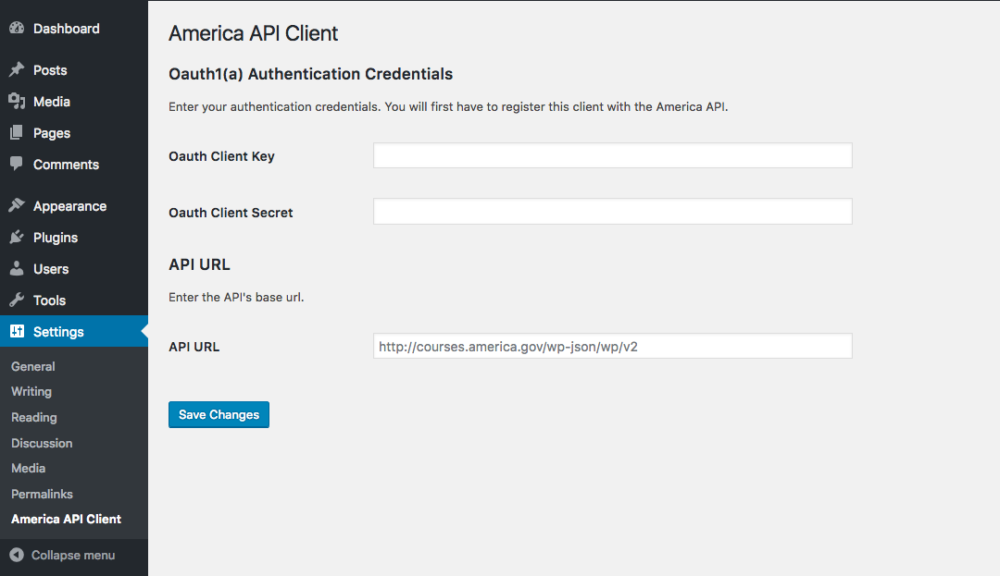

# America API Client

A Wordpress plugin for consuming the America API.

## Settings



`Oauth Client Key`: Currently not used. Added for future implementation.

`Oath Client Secret`: Currently not used. Added for future implementation.

`API URL`: The API URL

## Wordpress Shortcode

```
[course id="1"]
```

Embed a course in a post or page
